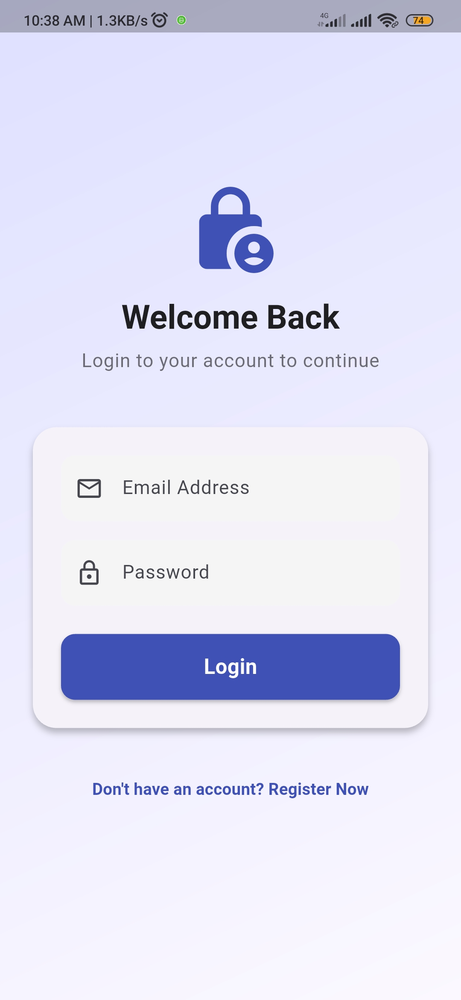
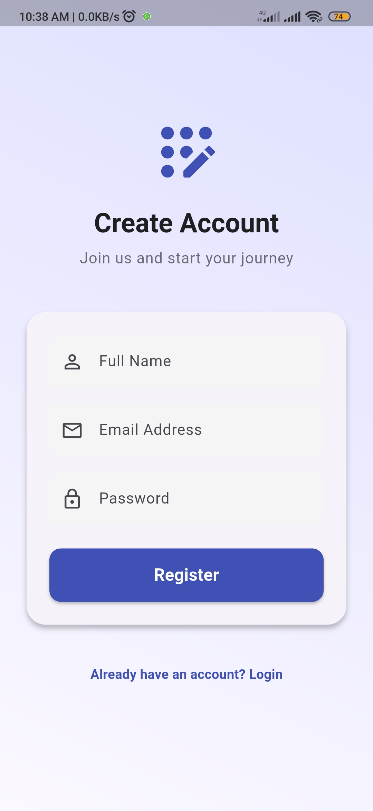
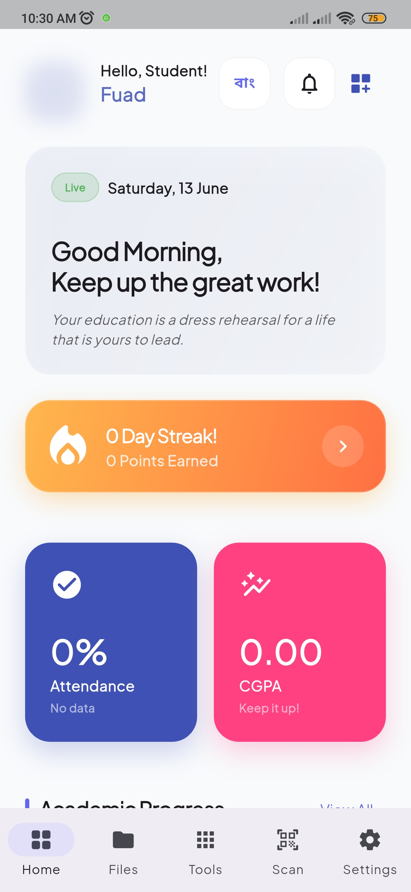
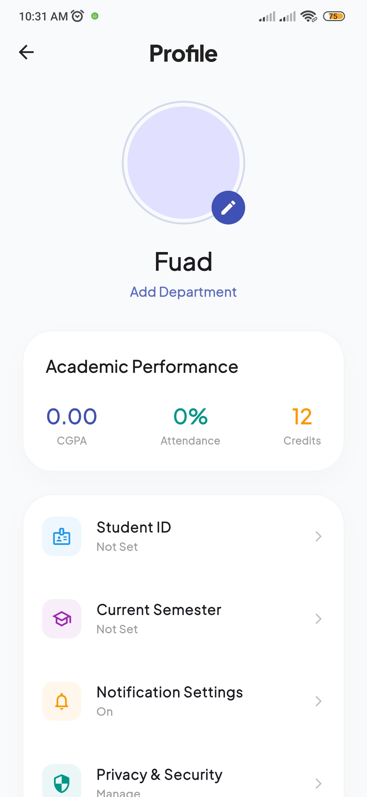
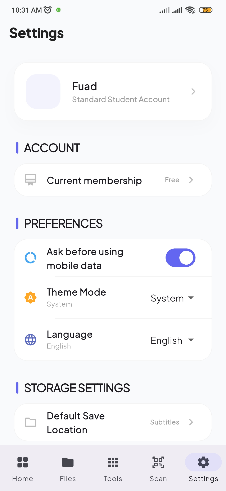
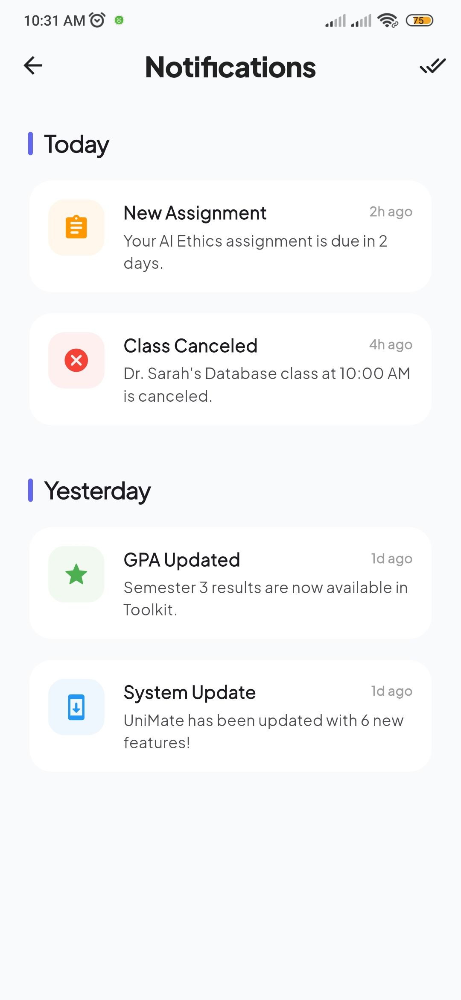
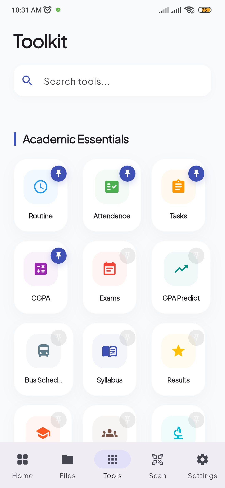
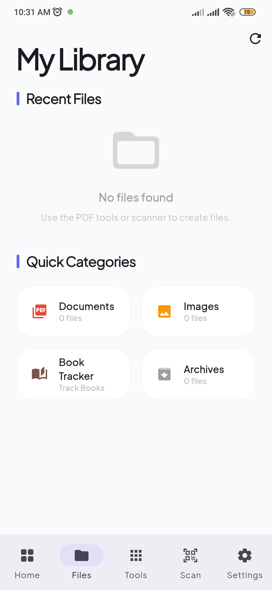

# 🎓 UniMate
### **Your All-in-One Smart University Companion**

**Designed to simplify student life, boost productivity, and keep everything academic in one intelligent ecosystem.**

---

---

## ✨ Overview

UniMate is a modern, feature-rich student productivity platform built with Flutter, crafted specifically for university students who want more than just a routine app.

From managing academics and finances to AI-powered assistance and productivity tools, UniMate transforms scattered student tasks into one seamless experience.

Think of it as your **digital academic command center**.

  
  
  
  
   
  
  
  
  
   
  
  
  

---

## 🌟 Core Experience

### 🎯 Academic Essentials
Built to keep your university life organized and predictable.

- 📅 **Smart Routine Manager**  
  Organize daily class schedules with a clean visual planner.

- 📈 **Attendance Analytics**  
  Track course attendance with insights and shortage warnings.

- 📝 **Assignment & Exam Planner**  
  Manage deadlines, quizzes, submissions, and exam schedules.

- 🎓 **CGPA Calculator + GPA Forecasting**  
  Monitor performance and predict future academic outcomes.

- 🚌 **University Transport Schedule**  
  Instantly access bus timings and transport routes.

- 👨‍🏫 **Faculty Directory**  
  Keep faculty contact information accessible.

- 📚 **Library Organizer**  
  Track borrowed books, due dates, and reading lists.

  
  
  
  
   
  
  
  
  
   
  
  
  
  
   
  
  

---

### 💼 Academic PDF Tools
Handle everyday university life beyond academics.

- 💸 **Expense Intelligence Dashboard**  
  Track spending with analytics and category breakdowns.

- 🍽️ **Mess & Shared Cost Management**  
  Manage meal systems, contributions, and roommate expenses.

- 🗒️ **Notes Vault**  
  Store academic notes, reminders, and quick references.

- 🎙️ **Voice Memo Support**  
  Capture ideas and reminders instantly.

- 📆 **Holiday Calendar**  
  University + national holidays in one place.

  
  
  
  
   
  
  
  
  
   
  
  
  
  
   
  
  
  
  
   
  
  

---

### 🚀 Productivity
Built to help students focus, learn, and perform better.

- ⏳ **Pomodoro Focus System**  
  Structured study sessions with timer-based productivity.

- ✅ **Habit Builder**  
  Build discipline with streak tracking.

- 🧠 **Flashcard Learning System**  
  Reinforce learning with active recall.

- 📄 **Document Scanner + OCR**  
  Scan notes, documents, and extract text instantly.

- 🔲 **QR Generator**  
  Fast QR creation utility.

- 🔢 **Quick Calculator**  
  Lightweight built-in calculations.

- 🌍 **Currency & Unit Converter**  
  Fast everyday conversions.

  
  
  
  
   
  
  
  
  
   
  
  
  
  
   
  
  
  

---

### 🤖 AI-Powered Tools
Your intelligent academic helper.

- AI study assistance
- Concept explanations
- Quick academic support
- Productivity guidance
- Smart interactions powered by Google Generative AI

  
  
  
  
   
  
  
  
  
   
  
  
  
  

---

## 🏗️ Architecture & Technology

UniMate is engineered using a scalable modern Flutter stack.

| Layer | Technology |
|------|------------|
| Framework | Flutter |
| Language | Dart |
| State Management | Riverpod |
| Local Database | Drift (SQLite) |
| AI Integration | Google Generative AI |
| OCR | Google ML Kit Text Recognition |
| Notifications | flutter_local_notifications |
| Charts & Analytics | fl_chart |
| Animations | flutter_animate + Lottie |
| Typography | Google Fonts |

---

## 📱 Platform Support

- ✅ Android
- ✅ iOS 
- ✅ Web 
- ✅ Windows
- ✅ Linux

---

## 🌐 Localization

Multi-language support included:

- 🇬🇧 English
- 🇧🇩 বাংলা

---

## 📄 License

Distributed under the MIT License. See `LICENSE` for more information.

  Developed with ❤️ by <b>Team Softece</b> 
  <i>UniMate</i>

